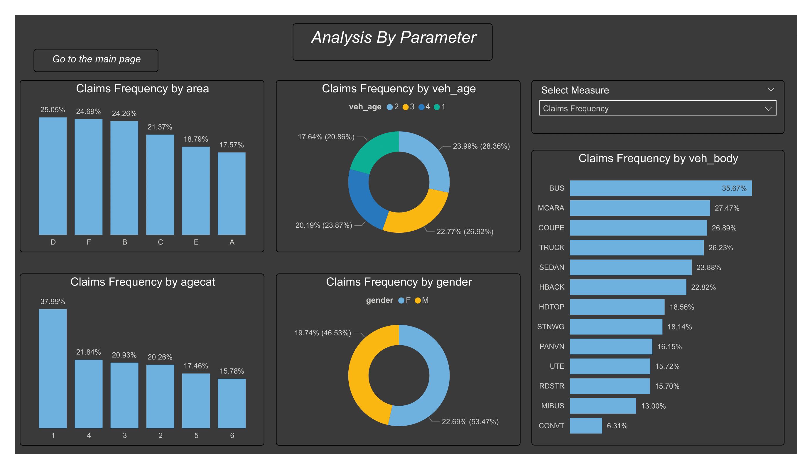
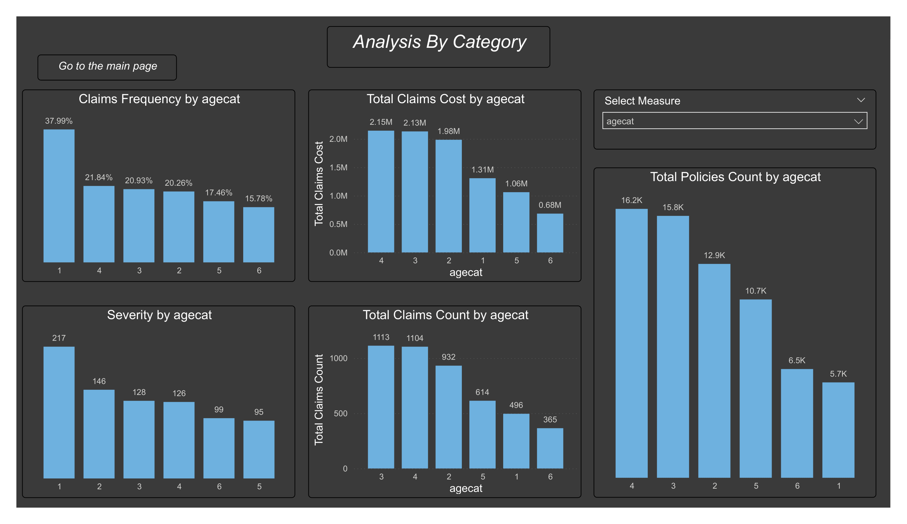
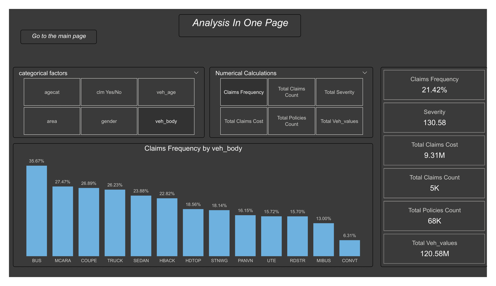
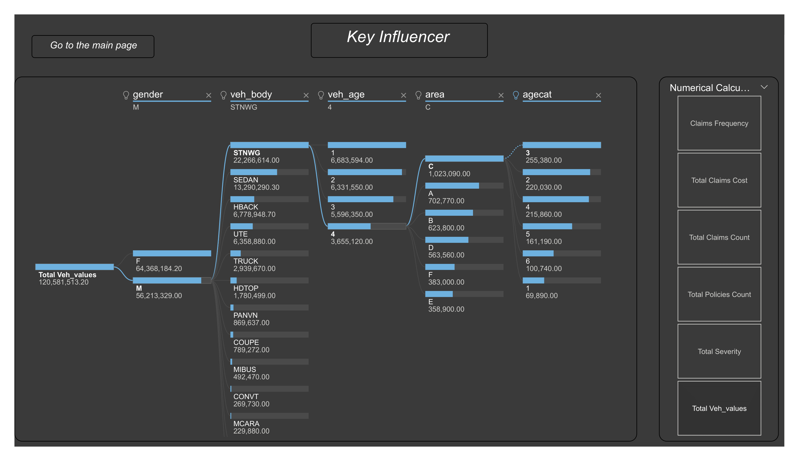
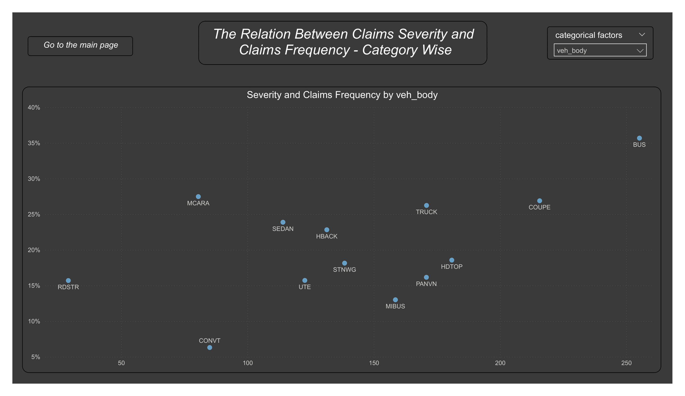

# ***Auto Insurance Analysis***

## *Overview*
*This project offers an in-depth analysis of Auto Insurance leveraging **Power BI tools**. Key business metrics and trends are visualized through a comprehensive dashboard. The insights derived facilitate data-driven decision-making, aiding Risk Managment and business growth.*

## *To access the project online ,Click on the below link*

[*Motor Insrance analysis-2 Link*](https://app.powerbi.com/view?r=eyJrIjoiZGNiNDAxNjctZGJjZC00N2E2LTk3NGUtMTc3YTM2OWEzZjJhIiwidCI6IjA5N2I0YWUwLWQwNmEtNGY4Mi1iODBhLTVmYWM1NTZjMDQzNyIsImMiOjl9)

## *Aim*
*The primary goal is to provide actionable insights into the Auto Insurance Line, pinpointing areas for enhancement and growth through comprehensive analysis.*

## *Tools Utilized*
* *Microsoft Power BI*

## *1st Report page -Analysis By Numercial Measures*

***The Numercial Measures Are:***  
***Claims Frequency***    
***Claims Total Cost***  
***Claims Severity***   
***Total Vehcile Values***  
***Number Of Polices***  

***Apply The Numercial Measures on All Caregorical Groups to conduct a comparison and notice the high,median,and low risk***

## *2nd Report page -Analysis By Caregorical Groups*

***The Caregorical Groups Are:***    
***Age Category***      
***Area Category***   
***Claims YES/NO Category***    
***Gender Category***    
***Vehicle Age Category***     
***Vehicle Body Category*** 

***Apply The Caregorical Groups on All Numercial Measures to conduct a comparison and notice the high,median,and low risk***

## *3rd Report page -Analysis in one Page*

***Condacting Caregorical Groups Analysis and Numercial Measures Analysis in one page***

## *4th Report page -Key Influencer*

***Find out the Key Influencer and  what drive the Numercial Measures to increarse or decrease based on the categorical Groups*** 

## *5th Report page -The Relation between Claims Count and Claims Frequency*

  

***Find out the Relation between Claims Count and Claims Frequency between on the categorical Groups*** 

## *Conclusion*
*This project harnesses Power BI's capabilities to empower stakeholders with a dynamic platform for Auto Inurance data analysis. The derived insights lead to informed decisions and refined Risk Managment strategies.*